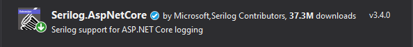
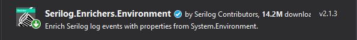
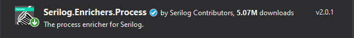
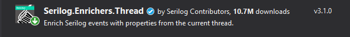
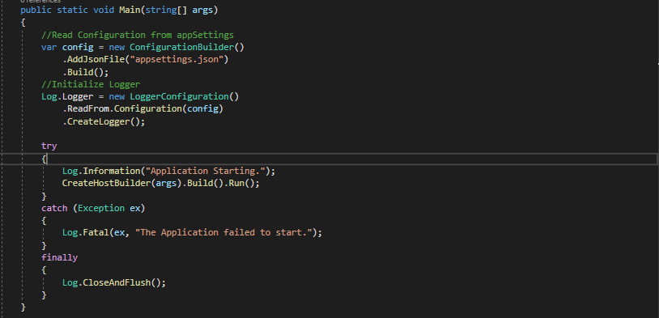
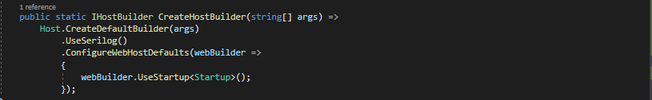
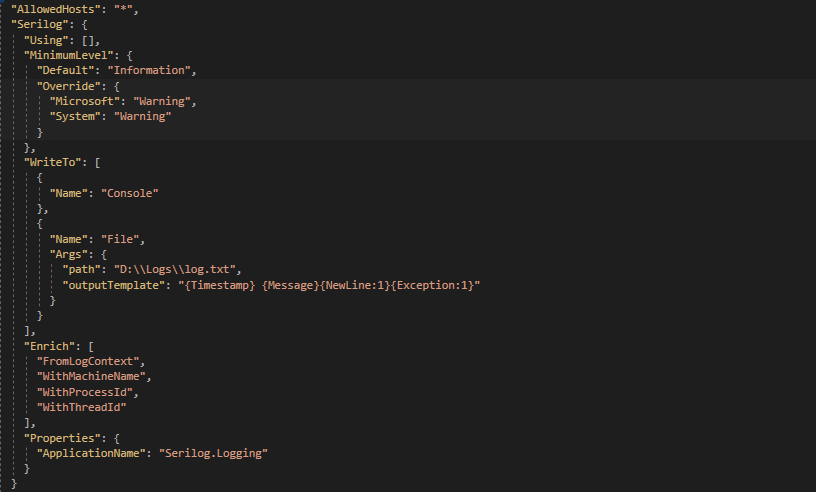
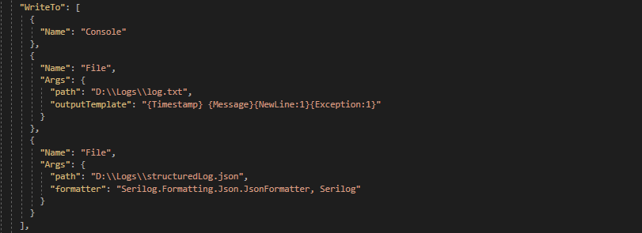

# logging_serilog

## Used Technologies

1. dotnetcore 3.1

## Quick Started

1. Checkout the code.
2. Open a cmd inside 'logging' folder where you cloned the code.
3. Run 'dotnet run --project ./logging.csproj' or 'dotnet run'
4. cmd will display '[07:40:48 INF] Application Starting.'
5. Type 'https://localhost:5000/weatherforecast' in the browser.
6. Now there will be additional logs of infomation and exception in the cmd.
7. Navigate to 'D:\Logs', find the log files written inside that

## Getting Started

First create a web api project. Then add Serilog.AspNetCore, Serilog.Enrichers.Enviorenment, Serilog.Enrichers.Process and Serilog.Enrichers.Thread nuget packages.

## Configure Serilog

First configure serilog in Program.cs. There the 'finally' block allows logger to log any pending messages while the application closes.

Then make changes to use serilog instead of default logger. Here Serilog configuring done using appsettings.json instead of configuring it in code. This allows to modify these setting at runtime easily.

## Configure appsettings.json

First remove the default logging setting. Then add the following to the file.

Minimum level of logging for different components is defined in the settings.json file. Anything above Information log level will be logged. But for specific components like Microsoft log only Warning or above.
Then the sink settings defined within 'WriteTo' list. At the moment configurations added only for File and Console sinks only.
Next remove the IIS profile from launchSettings.json and run the app. This allows to see logs in the console.

Have look at the logs in console and the folder which is defined in the appsettings.json. Logs are there or are they? Where is the Enriches and the structured logging? Answer is Console and File sinks don't support structured logging.

## Structured Logging

Add the following setting to appsettings.json to enable structured logging with file sink. There a JSON formatter is passed as a parameter to the settings.

Run the app again. Simulate an exception and have look at the json file. This is the structured log for an event given by serilog. Machine Name, ProcessId and few more details are there this time around.

